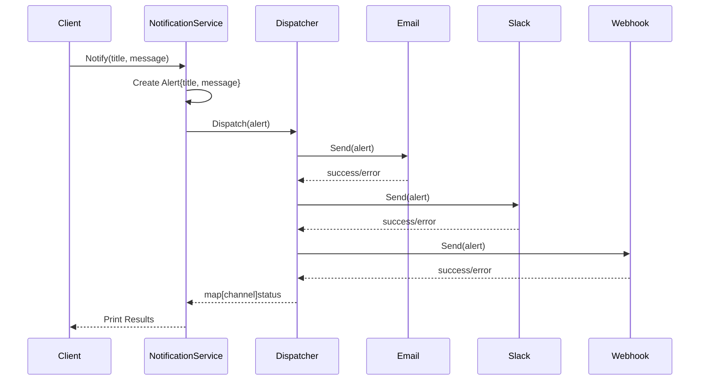
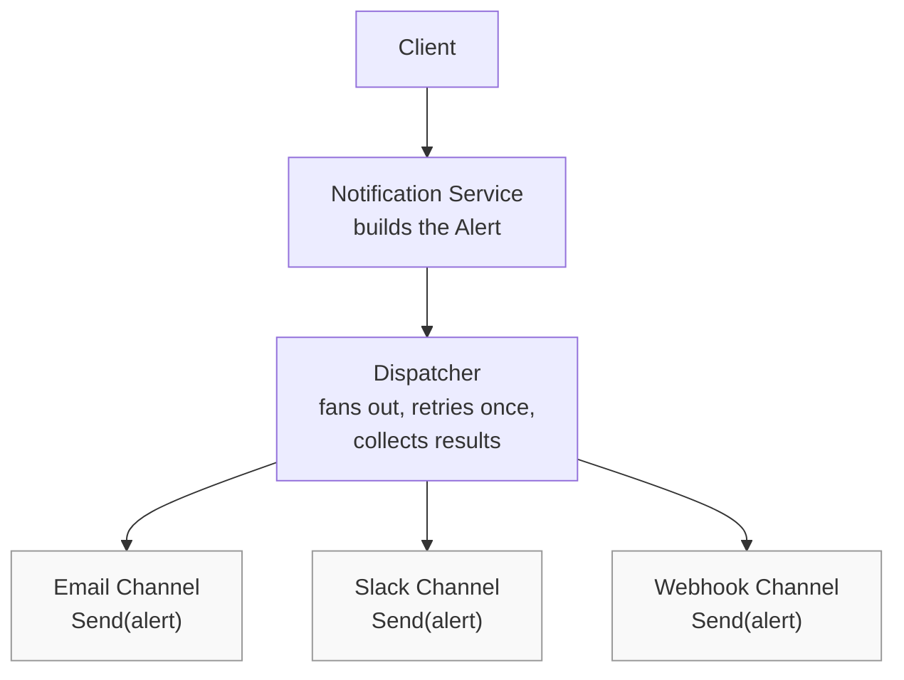
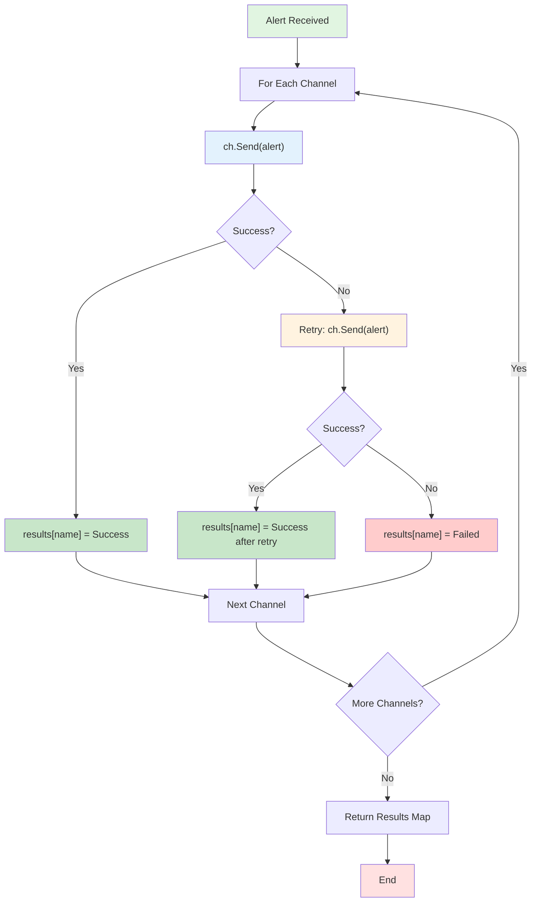
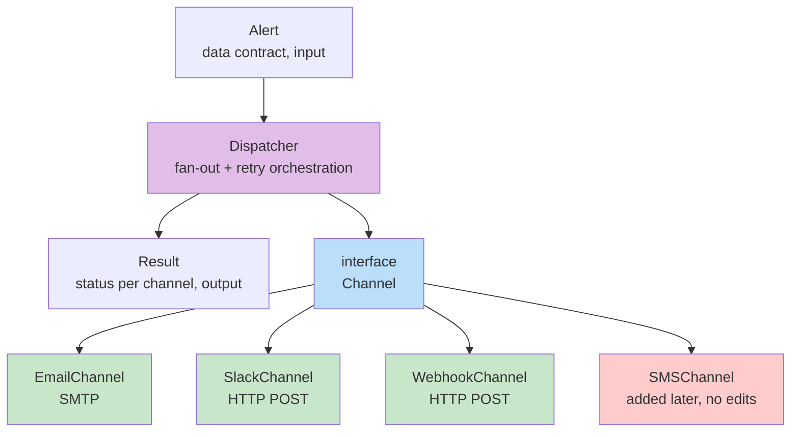

# Dispatcher

A Go-based notification dispatcher service that sends alerts through multiple channels (Email, Slack, Webhook) with built-in retry logic.

## Architecture

### High-Level Design (HLD)

The system follows a clean architecture pattern with clear separation of concerns:

```
Client → Notification Service → Dispatcher → Channels (Email/Slack/Webhook)
```

**Components:**
- **Client**: Entry point that initiates notifications
- **Notification Service**: Builds alert objects and orchestrates the dispatch
- **Dispatcher**: Core orchestration logic - fans out alerts to channels and retries failed sends
- **Channels**: Individual implementations for different notification mediums

Each channel implements the same two-method interface (`Send()` and `Name()`), allowing the Dispatcher to remain agnostic of specific channel implementations. This enables adding new channels without modifying the Dispatcher code.

**HLD Flow Diagram:**



**HLD Component Diagram:**



### Low-Level Design (LLD)

The detailed component architecture showing data flow and interface contracts:

**LLD Flow Diagram (Retry Logic):**



**LLD Component Diagram:**



**Key Points:**
- The Dispatcher depends on the `Channel` interface, never on concrete implementations
- Each channel implementation is independent and can be added/modified without affecting the Dispatcher
- New channels (e.g., SMSChannel) can be added by simply implementing the `Channel` interface
- The retry logic is centralized in the Dispatcher for consistency
- Every box in the bottom row implements Channel — Dispatcher's code never mentions any of them by name


## Project Structure

```
dispatcher/
├── main.go                 # Entry point
├── go.mod                  # Module definition
├── README.md              # This file
├── dispatcher/
│   └── dispatcher.go      # Core dispatcher logic
├── channel/
│   ├── channel.go         # Channel interface
│   ├── email.go           # Email channel implementation
│   ├── slack.go           # Slack channel implementation
│   └── webhook.go         # Webhook channel implementation
├── model/
│   └── alert.go           # Alert data model
└── service/
    └── notification.go    # Notification service
```

## How It Works

1. **Client** calls `NotificationService.Notify()` with title and message
2. **Notification Service** creates an `Alert` object and passes it to the Dispatcher
3. **Dispatcher** iterates through all registered channels and attempts to send the alert
4. **Channels** implement their specific send logic (SMTP for Email, HTTP POST for Slack/Webhook)
5. **Retry Logic**: If a channel fails, the Dispatcher retries once before marking as failed
6. **Results** are collected and returned as a map showing success/failure status for each channel
